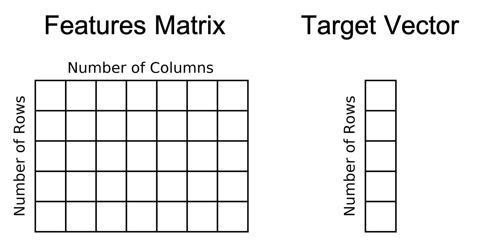
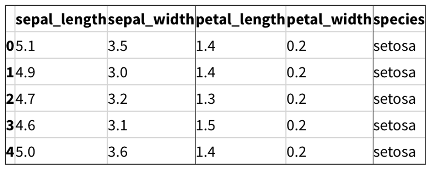

Scikit-learn is a great library for creating machine learning models from data. Before you can fit a model using scikit-learn, your data has to be in a recognizable format.
Scikit-learn works well with numeric data that is stored in numpy arrays. Additionally, you can convert your data from objects like pandas dataframes to numpy arrays.

## Features Matrix and Target Vector

The first thing we have to understand is what Scikit-Learn expects for Features Matrices and target vectors. 
In scikit-learn, a features matrix is a two-dimensional grid of data where rows represent samples and columns represent features. 
A target vector is usually one dimensional and in the case of supervised learning, what we want to predict from the data. 

Let's see an example of this. the image is a pandas dataframe of the first 5 rows of the iris dataset. 
A single flower represent one row of the dataset and the flower measurements are the columns. In this dataset, the species column is what you are trying to predict. 

