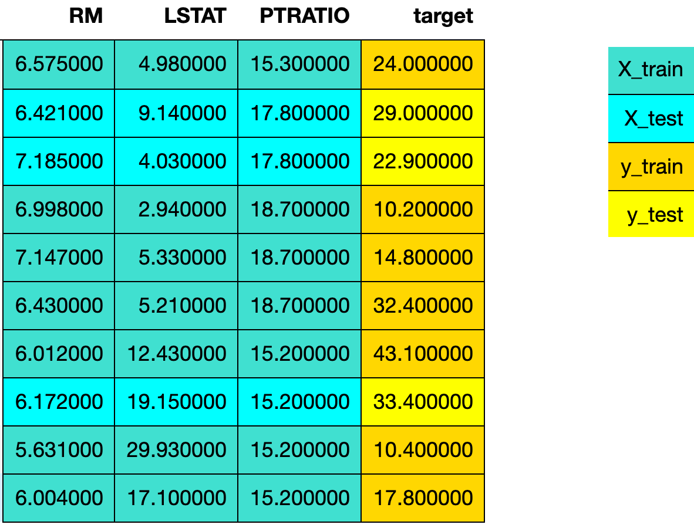

One of the goals of supervised learning is to build a model that performs well on new data. 
If we have new data, we could see how our model performs on it. 
The problem occurs when we may not have new data, but by using train-test_split we can simulate this experience.
In this notebook you will find how to perform train test split on your data.

## What is `train_test_split`?

1. Spliting the dataset into two pieces: a **training set** and a **testing set**. Typically, about 75% of the data goes to the training set and 25% goes to the test set. 
2. Train the model on the **training set**.
3. Test the model on the **testing set** and evaluate the performance 

The boston house-price dataset is used for this program which is a built-in scikit-learn dataset in the `sklearn.datasets module`.

The colors in the image indicate which variable (X_train, X_test, y_train, y_test) the data from the dataframe df went to for a particular train test split.

MODEL USED: `LinearRegression` from the `sklearn.linear module`

